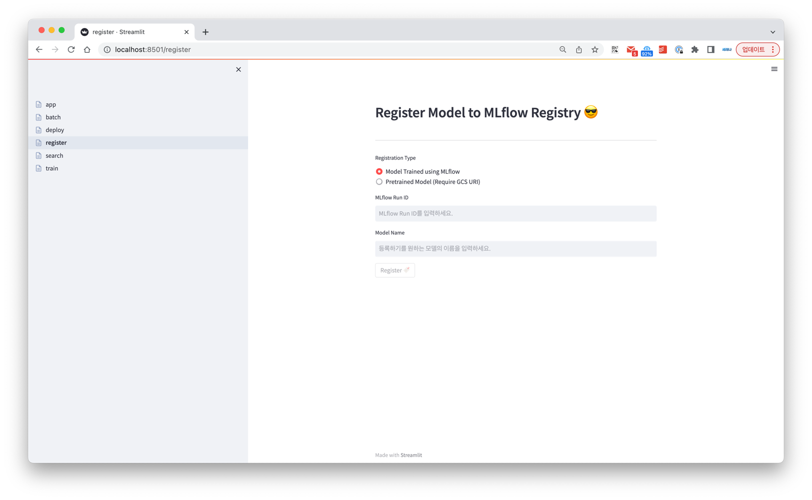

# SoMLier Web Admin

---
### Train Model
- 기본 화면 구성

- 사용 방법 (Parameter 입력하지 않는 경우)

- 사용 방법 (Parameter 입력하는 경우)

---
### Register Model
- 기본 화면 구성

- 사용 방법
  - MLflow을 통해 학습된 모델의 경우
    
  - 기존에 학습된 모델의 경우
    - sklearn 모델 
      
    - torch 모델
      
  

---
### Search Model
- 기본 화면
  
- 사용 방법
  

---
### Deploy Model
- WIP

---
### Offline Serve Model
- 기본 화면
  
- 사용 방법 
  - Docker Image를 이용한 경우 
    
    - Download 버튼을 누르면 아래와 같은 스크립트 파일이 다운된다.
      
  - SOCAR Data Provider를 이용한 경우
    

